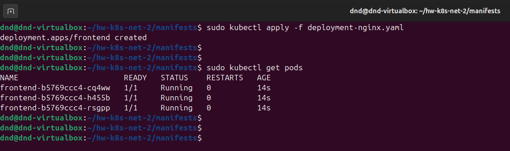
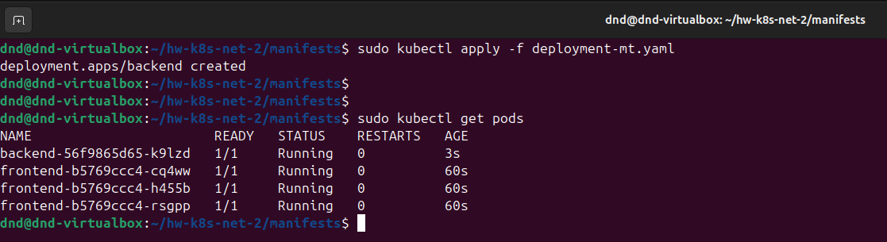
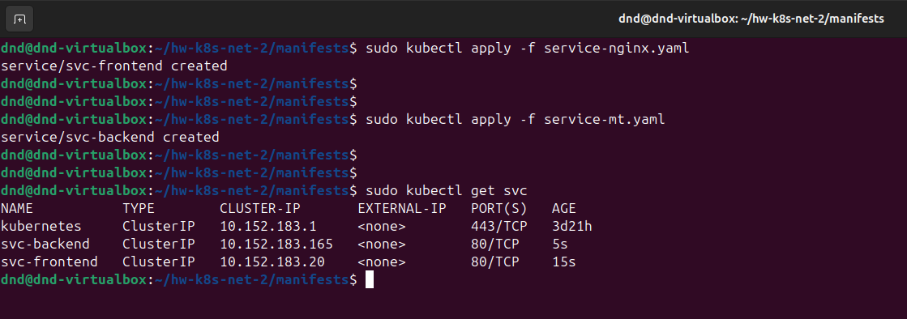
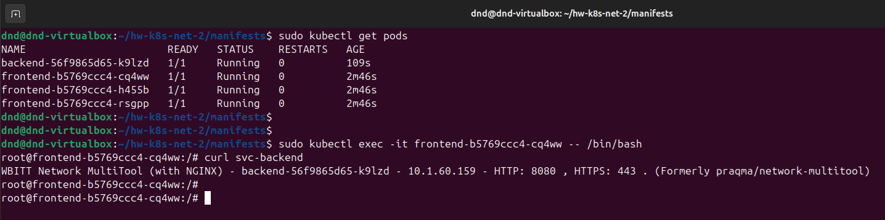
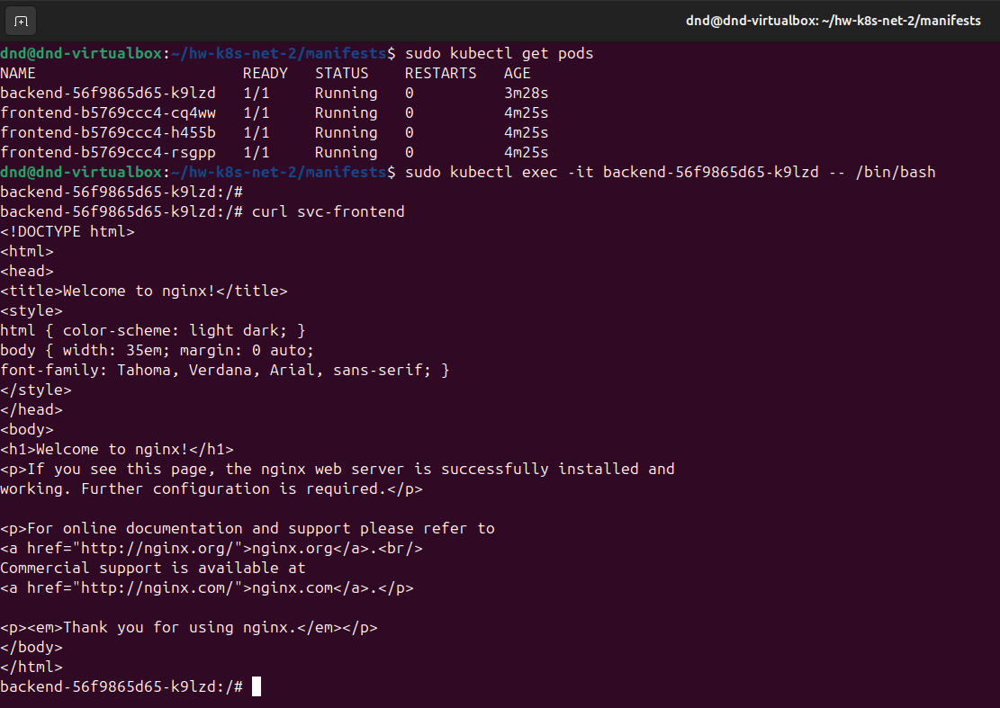

 # Домашнее задание к занятию "`Сетевое взаимодействие в K8S. Часть 2`" - `Дедюрин Денис`

---
## Задание 1. Создать Deployment приложений backend и frontend

1. Создать Deployment приложения _frontend_ из образа nginx с количеством реплик 3 шт.
2. Создать Deployment приложения _backend_ из образа multitool. 
3. Добавить Service, которые обеспечат доступ к обоим приложениям внутри кластера. 
4. Продемонстрировать, что приложения видят друг друга с помощью Service.
5. Предоставить манифесты Deployment и Service в решении, а также скриншоты или вывод команды п.4.

### Ответ:

1. Создаем Deployment приложения **frontend** (deployment-nginx.yaml):

```
apiVersion: apps/v1
kind: Deployment
metadata:
  name: frontend
spec:
  replicas: 3
  selector:
    matchLabels:
      app: frontend
  template:
    metadata:
      labels:
        app: frontend
    spec:
      containers:
      - name: nginx
        image: nginx:1.21
        ports:
        - containerPort: 80
```

```
sudo kubectl apply -f deployment-nginx.yaml
```

```
sudo kubectl get pods
```



2. Создаем Deployment приложения **backend** (deployment-mt.yaml):

```
apiVersion: apps/v1
kind: Deployment
metadata:
  name: backend
spec:
  replicas: 1
  selector:
    matchLabels:
      app: backend
  template:
    metadata:
      labels:
        app: backend
    spec:
      containers:
      - name: multitool
        image: wbitt/network-multitool
        env:
          - name: HTTP_PORT
            value: "8080"
        ports:
        - containerPort: 8080
        name: http-port
```

```
sudo kubectl apply -f deployment-mt.yaml
```

```
sudo kubectl get pods
```



3. Создаем сервисы для приложений (service-nginx.yaml и service-mt.yaml): 

```
apiVersion: v1
kind: Service
metadata:
  name: svc-frontend
spec:
  selector:
    app: frontend
  ports:
  - protocol: TCP
    port: 80
    targetPort: 80
```

```
apiVersion: v1
kind: Service
metadata:
  name: svc-backend
spec:
  selector:
    app: backend
  ports:
  - protocol: TCP
    port: 80
    targetPort: 8080
```

```
sudo kubectl apply -f service-nginx.yaml
```

```
sudo kubectl apply -f service-mt.yaml
```

```
sudo kubectl get svc
```



4. Проверяем доступность приложений, что они видят друг друга:

```
sudo kubectl exec -it    -- /bin/bash
```

```
sudo kubectl exec -it    -- /bin/bash
```
frontend -> backend



backend -> frontend



---
## Задание 2. Создать Ingress и обеспечить доступ к приложениям снаружи кластера

1. Включить Ingress-controller в MicroK8S.
2. Создать Ingress, обеспечивающий доступ снаружи по IP-адресу кластера MicroK8S так, чтобы при запросе только по адресу открывался _frontend_ а при добавлении /api - _backend_.
3. Продемонстрировать доступ с помощью браузера или `curl` с локального компьютера.
4. Предоставить манифесты и скриншоты или вывод команды п.2.

### Ответ: